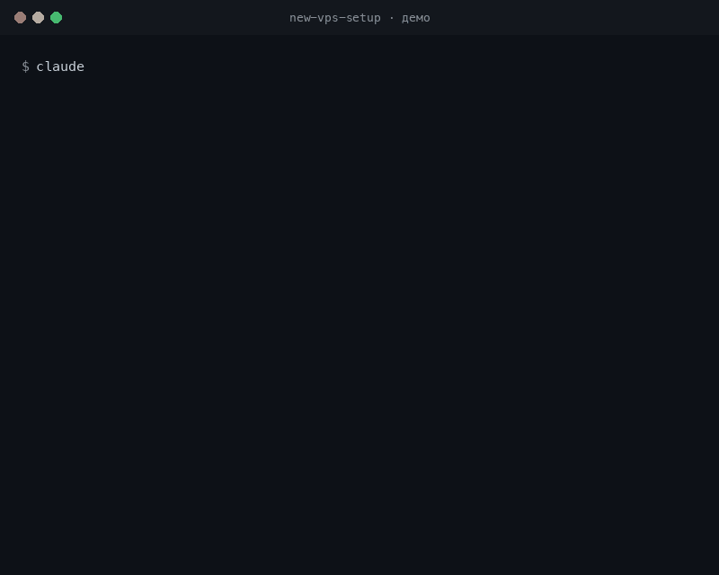

# 🛡️ new-vps-setup

> Пошаговый, безопасный путь от чистого Ubuntu VPS до готового к продакшну сервера —
> для тех, кто делает это впервые.

Это **agent skill** (для [Claude Code](https://claude.com/claude-code) и совместимых
агентов) и одновременно **читаемый чеклист** для человека. Он проводит через настройку
нового сервера так, чтобы дальше он **обслуживал себя сам**: автообновления безопасности,
автоматические бэкапы с проверкой восстановления и мониторинг — с упором на безопасные
дефолты, а не на «как у профи».

**Целевая ОС:** Ubuntu 22.04 / 24.04 LTS.

<p align="center">
  
</p>

<p align="center"><sub>☝️ Иллюстративная анимация прохождения скилла (схематичный пример, не запись реальной сессии)</sub></p>

---

## ✨ Что внутри

| Раздел | Что настраивает |
|--------|-----------------|
| 🔍 **Диагностика** | Что уже сделано на свежем сервере (cloud-init, ufw, автообновления) |
| 🔐 **Hardening** | sudo-пользователь (без NOPASSWD), вход по SSH-ключу, отключение пароля, fail2ban |
| ♻️ **Автообновления** | `unattended-upgrades` — security-патчи ставятся сами (ядро автономности) |
| 🧱 **Файрвол** | UFW: закрыто всё, открыто только нужное; админки за доверенными IP |
| 🐳 **Docker** | Установка, лог-ротация, важное предупреждение «Docker обходит UFW» |
| 🌐 **nginx + HTTPS** | Reverse proxy + бесплатный сертификат Let's Encrypt с автопродлением |
| 💾 **Бэкапы** | restic + offsite (S3/Backblaze B2), ротация, **обязательное учебное восстановление** |
| 📈 **Мониторинг** | Внешний uptime + алерты по диску/памяти в Telegram |
| 🗓️ **Регламент** | Что делать ежедневно/еженедельно/ежемесячно (и что делает автоматика) |
| ✅ **Чеклист** | Финальная проверка готовности к проду |

---

## 🪶 Потребление ресурсов (для скромных VPS)

Коротко: **в покое обвязка почти ничего не ест и спокойно живёт на 1 ГБ RAM / 1 vCPU.**
Ресурсы съедает само приложение, а не настройка сервера.

| Компонент | RAM в покое | CPU в покое | Диск (пакеты) |
|-----------|-------------|-------------|---------------|
| fail2ban | ~15–30 МБ | ~0 | ~5 МБ |
| UFW | ~0 (правила в ядре) | 0 | — |
| unattended-upgrades, таймеры, cron | ~0 (по расписанию) | 0 | ~10 МБ |
| nginx (если ставишь) | ~5–10 МБ | ~0 | ~15 МБ |
| restic | 0 в покое | 0 | ~25 МБ |
| **Итого обвязка** | **~30–50 МБ** | **~0%** | **~50–150 МБ** |

**Пики — ночные и короткие:** ежедневный `apt upgrade` и бэкап restic дают всплеск
CPU/RAM/IO на несколько минут (restic жмёт и хеширует данные). Для этого в инструкции
есть **swap** — он гасит пик RAM, чтобы OOM не убил приложение на маленькой машине.

**Если VPS совсем скромный:**

- **Docker — самый прожорливый и опциональный.** Демон ест ~50–80 МБ RAM плюс образы на
  диске. Не нужны контейнеры — не ставь, потребление падает заметнее всего.
- **Swap:** по умолчанию 2 ГБ; на маленьком диске (10–20 ГБ) сделай 1 ГБ.
- restic-проверку целостности при дефиците CPU/трафика можно проредить (`1/90` или раз в
  неделю), но совсем не убирать.
- fail2ban оставляй — дёшев, а пользы много.

---

## 📦 Установка

Склонируй репозиторий прямо в директорию скиллов своего агента:

```bash
# Claude Code
git clone https://github.com/igor-batrakov/new-vps-setup.git ~/.claude/skills/new-vps-setup

# Codex / Copilot CLI / Gemini CLI (общий кросс-runtime путь)
git clone https://github.com/igor-batrakov/new-vps-setup.git ~/.agents/skills/new-vps-setup
```

Перезапусти сессию агента — скилл подхватится автоматически.

---

## 🚀 Как пользоваться

**Вариант А — через агента (рекомендуется).** Скилл активируется сам по смыслу запроса.
Просто попроси:

> «Помоги настроить новый Ubuntu VPS под продакшн»
> «Сделай hardening моего сервера и настрой автобэкапы»

Агент пойдёт по шагам: сначала **диагностика** (что уже есть), затем настройка с проверкой
после каждого шага.

**Вариант Б — как чеклист руками.** Открой [`SKILL.md`](SKILL.md) и [`references/backups.md`](references/backups.md)
и выполняй команды сам. Это полноценная инструкция, читается без агента.

---

## ⚠️ Прежде чем начать — прочитай

- **Это руководство, а не автоустановщик.** Оно *проводит* через настройку и объясняет
  каждый шаг — оно не запускает магический скрипт «всё сразу».
- **Hardening может отрезать тебе SSH.** Скилл специально учит проверять доступ в *новой*
  сессии перед закрытием старой — но всё равно **убедись, что у провайдера есть консоль/VNC**
  на случай потери доступа.
- **Сначала потренируйся на «одноразовом» VPS.** Подними дешёвый сервер, пройди скилл целиком,
  поломай и пересоздай — и только потом делай это на боевом.
- **Безопасные дефолты намеренно строгие.** Никакого NOPASSWD-sudo, никаких отключённых
  проверок «ради удобства» — это для прода, а не для песочницы.

---

## 🗂️ Структура

```
new-vps-setup/
├── SKILL.md              # основной пошаговый гайд (разделы 0–9)
└── references/
    └── backups.md        # restic: установка, скрипт, таймер, восстановление
```

---

## 🤝 Вклад

Нашёл неточность в команде или знаешь более безопасный дефолт — открывай issue или PR.
Особенно ценны правки, которые делают шаги *безопаснее для новичка*.

## 📄 Лицензия

[MIT](LICENSE) — используй, меняй, распространяй свободно.
